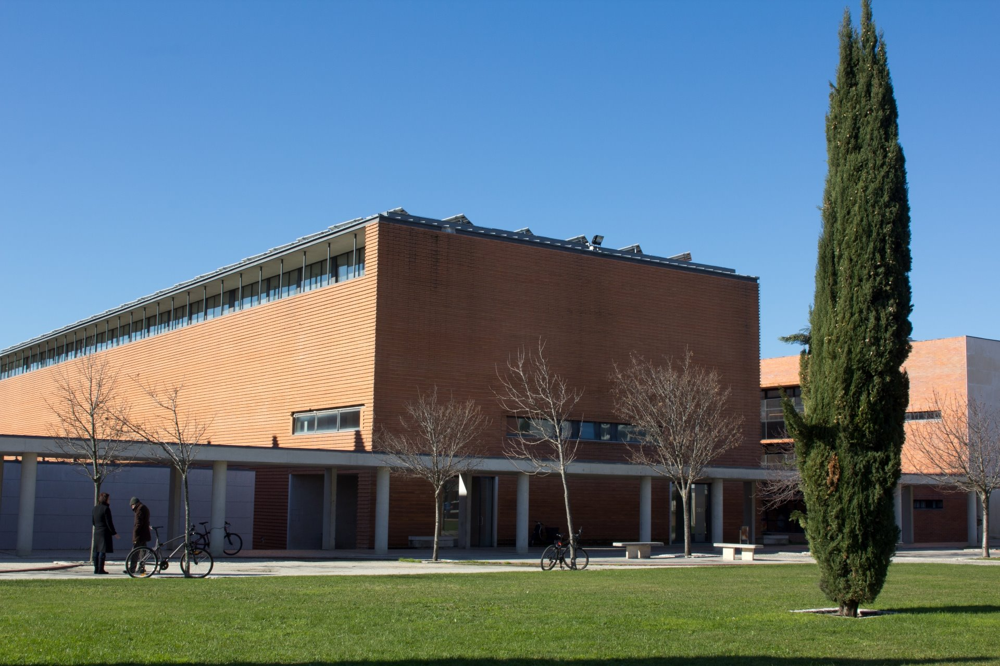

# IEM — Módulo de Visão Artificial
# Aula Prática 1 — Primeiros passos em MATLAB

**Departamento de Engenharia Mecânica · Universidade de Aveiro**\
**Docente:** Miguel Riem de Oliveira · **Duração:** 3 horas

---

## Enquadramento

Ao longo das próximas duas aulas será desenvolvido um programa a que chamamos
**IEM Paint**.

Considere o programa de desenho que já terá utilizado no computador. Quando se
pinta com o rato, aquilo que é efetivamente fornecido ao computador é uma
sequência de **coordenadas**: o cursor esteve aqui, depois aqui, depois aqui. O
programa liga esses pontos e surge um traço no ecrã.

O IEM Paint faz exatamente o mesmo, mas sem rato. A câmara do computador
portátil observa o utilizador, o programa procura na imagem um objeto vermelho
que este segure na mão, determina onde esse objeto se encontra, e utiliza essa
posição como se fosse a posição do rato.

```
   rato ────────────────────┐
                            ├──► coordenadas (x,y) ──► traço no ecrã
   câmara + objeto vermelho ┘
```

A parte interessante é a intermédia: **de que forma pode um programa observar
uma imagem e determinar onde se encontra a mancha vermelha?** É a isso que se
chama visão por computador.

Nesta aula ainda não será construído o IEM Paint. Nesta aula serão resolvidos
**muitos exercícios curtos** de MATLAB, que é a forma como se aprende a
programar. Os exercícios estão ordenados de forma deliberada: cada secção
corresponde a uma competência que as aulas seguintes irão exigir. A última
secção termina com a deteção de uma cor numa fotografia — que é,
essencialmente, o problema do IEM Paint resolvido numa imagem parada.

A câmara será introduzida na aula teórico-prática, e o programa completo na
aula prática seguinte.

---

## Método de trabalho

**Os exercícios são muitos e são curtos.** Não é esperado que se demore vinte
minutos em cada um. Guarde-os todos no mesmo ficheiro, cada um na sua secção
`%%`, de modo a ter no final o registo completo da aula num único sítio, e a
poder voltar a executar qualquer um deles com Ctrl+Enter.

**Não é obrigatório concluir os 35 exercícios.** A secção 4 é a essencial: quem
o completar sai desta aula preparado para o que se segue.

**Os enunciados indicam o nome da função a utilizar, mas não a forma de a
utilizar.** Essa parte cabe-lhe a si: consultar a documentação, ler que
argumentos a função aceita e que valores devolve, e experimentar. Este
procedimento não é um atalho ilegítimo: é a forma como se trabalha. Dentro do
próprio MATLAB:

```matlab
help imresize     % resumo rápido
doc imresize      % página completa, com exemplos
```

Fora do MATLAB, uma pesquisa por `matlab imresize` conduz à mesma página.

**Antes de executar, preveja o resultado.** Vários exercícios pedem que
indique o que espera que aconteça antes de carregar em *Run*. Faça-o com
seriedade: é nesse momento que se aprende, e não na leitura do resultado.

**Errar é o funcionamento normal.** Ao longo da aula surgirão mensagens de erro
com frequência. Leia-as: indicam quase sempre a linha e a natureza do problema.

---

# Secção 0 — Arranque

*Sem estes passos, nada do resto da aula funciona.*

**0.** Abra o MATLAB e **maximize a janela**. Caso o tamanho da letra seja
reduzido, aumente-o desde já em *Preferences → Fonts*. Programar numa janela
pequena é uma dificuldade acrescida e desnecessária.

O MATLAB é disponibilizado gratuitamente aos estudantes da Universidade de
Aveiro. A licença, o instalador e as instruções encontram-se em:

> **<https://www.ua.pt/pt/stic/matlab>**

Além do MATLAB, são necessárias duas *toolboxes*, que se selecionam durante a
instalação ou, mais tarde, através do *Add-On Explorer* do próprio MATLAB:

- **Image Processing Toolbox**
- **Image Acquisition Toolbox**

Confirme, com o comando `ver`, que ambas se encontram disponíveis.

É ainda necessário um terceiro componente, que é o que permite o acesso à
câmara:

- **MATLAB Support Package for USB Webcams**

Este componente **não faz parte do instalador** e é, por isso, o mais
frequentemente esquecido. Instala-se depois, com o MATLAB já a funcionar, em
*Home → Add-Ons → Get Hardware Support Packages*, pesquisando por "USB
Webcams". Requer ligação à Internet e sessão iniciada na conta MathWorks
utilizada para ativar a licença, e demora alguns minutos. Note que não surge na
lista do `ver`; a forma de confirmar que está instalado é a verificação
seguinte.

Confirme então que o MATLAB deteta a câmara do computador portátil: o comando
`webcamlist` lista as câmaras ligadas ao computador. Caso surjam **duas**,
registe esse facto: muitos computadores portáteis possuem uma câmara
convencional e uma câmara de infravermelhos, e será necessário escolher a
correta mais adiante.

> Se alguma destas verificações falhar, contacte o docente **de imediato**, e
> não no final da aula.

---

# Secção 1 — Primeiro contacto com o MATLAB

*Objetivo: no final da secção existe um programa, guardado em ficheiro, que
executa.*

Antes de escrever qualquer instrução, identifique as quatro zonas da janela:

- **Command Window** — para instruções soltas e experimentação
- **Workspace** — a lista das variáveis existentes neste momento
- **Current Folder** — a pasta de trabalho atual
- **Editor** — onde se escrevem os programas

**1.** Utilize a *Command Window* como calculadora. Calcule `3 + 4 * 2` e, em
seguida, `(3 + 4) * 2`. Justifique a diferença entre os dois resultados.

**2.** Crie uma variável `a` com o valor 5 e uma variável `b` com o valor 3.
Calcule `a + b`. Observe o *Workspace* e confirme que as três variáveis foram
criadas.

**3.** Repita a atribuição de `a`, terminando agora a linha com ponto e
vírgula: `a = 5;`. Identifique a diferença de comportamento e indique em que
situações será conveniente utilizar o `;`.

**4.** Experimente os comandos `clc` e `clear`. Um deles limpa o ecrã e o outro
limpa a memória. Determine qual é qual, confirmando no *Workspace*.

**5.** Abra o Editor e guarde um ficheiro com o nome `aula1.m` numa pasta sua.
**Sem espaços e sem acentos no nome do ficheiro.** É neste ficheiro que serão
guardados os exercícios seguintes.

**6.** Escreva no topo do ficheiro um comentário (linha iniciada por `%`) com o
seu nome, número mecanográfico e data.

**7.** A seguir ao cabeçalho, escreva as três instruções que devem iniciar
qualquer programa:
```matlab
clear;       % ?
close all;   % ?
clc;         % ?
```
Indique, em comentário, a função de cada uma. A terceira ainda não poderá ser
testada nesta fase.

**8.** Transcreva para o script os exercícios 1 e 2 e execute-o com o botão
*Run*. Execute-o **duas vezes consecutivas** e justifique a necessidade da
instrução `clear` no início.

**9.** Divida o ficheiro em secções, colocando `%%` numa linha antes de cada
exercício, com a indicação do respetivo número:
```matlab
%% Exercício 8
...
%% Exercício 9
...
```
Coloque o cursor dentro de uma secção e carregue em **Ctrl+Enter**: apenas essa
secção é executada, sem executar o restante ficheiro. Este é o método de
trabalho a utilizar no resto da aula; sem ele, cada exercício obrigaria a
executar todos os anteriores.

---

# Secção 2 — Matrizes

*Objetivo: no final da secção será pintado um quadrado preto numa folha branca.*

**10.** Crie a matriz seguinte e identifique o papel do `;` no interior dos
parênteses retos:
```matlab
M = [1 2 3; 4 5 6; 7 8 9];
```
Determine as dimensões da matriz com a função `size` e indique qual dos dois
valores corresponde ao número de linhas.

**11.** Mostre o elemento da linha 2, coluna 3. Em seguida, mostre **a linha 2
completa** — existe uma forma de indicar "todos" ao MATLAB, através de dois
pontos: `:`. Mostre também a coluna 3 completa.

**12.** Mostre apenas a sub-matriz formada pelas linhas 1 a 2 e pelas colunas
2 a 3.

**13.** Proceda agora no sentido inverso: **altere** o elemento da linha 1,
coluna 1 para o valor 100. Em seguida, e **numa única instrução**, atribua o
valor zero a toda a sub-matriz formada pelas linhas 2 a 3 e pelas colunas 1 a 2.

**14.** Crie uma matriz preenchida com uns, com 200 linhas e 300 colunas,
utilizando a função `ones`. Os valores não devem, evidentemente, ser escritos
manualmente.

**15.** A função `imshow` apresenta uma matriz **como se fosse uma imagem**.
Aplique-a à matriz do exercício anterior.

Antes de executar, **preveja o resultado**: uma matriz preenchida com uns,
interpretada como imagem, corresponderá a quê?

**16.** Atribua o valor zero a uma região quadrada no centro dessa matriz — por
exemplo, das linhas 90 a 110 e das colunas 140 a 160 — e volte a apresentá-la.

Acabou de pintar. Note que não foi necessário qualquer conhecimento sobre
imagens para o fazer: **uma imagem é uma matriz.**

---

# Secção 3 — Imagens

*Objetivo: compreender o conteúdo de uma fotografia.*

**17.** Juntamente com este guião é fornecida a fotografia `dem_ua.jpg`, do
edifício do Departamento de Engenharia Mecânica. Copie-a para a sua pasta de
trabalho, leia-a para uma variável com a função `imread` e apresente-a.



**18.** Determine as dimensões dessa imagem. **São apresentados três valores**,
e não dois. Os dois primeiros já são conhecidos. Antes de prosseguir com a
leitura, formule uma hipótese sobre o significado do terceiro.

Uma imagem a cores é constituída por **três matrizes sobrepostas**. A primeira
indica, para cada pixel, a quantidade de vermelho; a segunda, a quantidade de
verde; a terceira, a quantidade de azul.

```
                   ┌──────────────┐
                   │              │ ← azul
                ┌──┴───────────┐  │
                │              │ ←│ verde
             ┌──┴───────────┐  │  │
             │              │ ←┘  │ vermelho
             │  L x C x 3   │─────┘
             └──────────────┘
```

**19.** Separe os três canais em três variáveis. Já sabe pedir "todas as linhas
e todas as colunas" com `:`; falta acrescentar um terceiro índice para
selecionar a camada:
```matlab
R = I(:,:,1);
```

**20.** Apresente os três canais lado a lado, cada um com o respetivo título.
A função `subplot` divide uma figura em várias células; a função `title`
escreve o título.

Observe agora a fachada de tijolo do edifício. **Qual dos três canais se
apresenta mais claro nessa zona?**

**21.** Consulte o valor de um pixel individual: `I(100, 200, :)`. São três
valores — a composição da cor desse pixel.

**22.** Os valores provenientes da câmara são inteiros entre 0 e 255, o que
dificulta a comparação. A função `im2double` converte uma imagem para valores
**entre 0 e 1**. Aplique-a e consulte novamente o mesmo pixel.

**23.** Esta imagem é demasiado grande e tornará o processamento lento.
Reduza-a para metade com a função `imresize` e confirme o resultado através
das dimensões.

---

# Secção 4 — Obter informação de uma imagem

*Esta é a secção mais exigente e a mais importante da aula.*

Pretende-se localizar, numa imagem, os pixels de uma determinada cor. A
abordagem imediata seria percorrer todos os pixels e verificar, um a um, se têm
essa cor. Uma
imagem de dimensão reduzida tem cerca de 300 mil pixels, pelo que essa
abordagem não é viável.

**24.** Comece por um caso simples. Crie `v = [4 8 15 16 23 42];` e execute:
```matlab
v > 10
```
Observe com atenção o resultado. **Não se trata de uma resposta, mas de seis.**
O MATLAB comparou todos os elementos simultaneamente e devolveu um valor
verdadeiro ou falso para cada um.

**25.** Guarde esse resultado numa variável designada `mascara`. É esta,
efetivamente, a designação utilizada: uma **máscara** é uma matriz de valores
verdadeiro/falso, com a mesma dimensão da original, que identifica os elementos
de interesse.

**26.** Execute `v(mascara)` e interprete o resultado obtido.

**27.** Numa única instrução, obtenha os elementos de `v` que são
simultaneamente maiores que 10 **e** menores que 30. Em MATLAB, a conjunção
"e" entre duas matrizes é o operador `&`.

**28.** Regresse à fotografia, na versão convertida para valores entre 0 e 1 e
reduzida para metade (exercícios 22 e 23), e separe de novo os canais `R`, `G`
e `B`. Pretende-se isolar a parede de tijolo **iluminada pelo sol**, à esquerda
do edifício. Escreva uma **única instrução** que produza uma máscara verdadeira
apenas nos pixels em que o vermelho é elevado **e** o verde não é demasiado
elevado **e** o azul é reduzido. Por exemplo:

> `R` acima de 0.7, `G` abaixo de 0.8, `B` abaixo de 0.65


Apresente essa máscara como imagem e verifique se as regiões brancas
correspondem à parede iluminada.

Note que a fachada maior, à sombra, não é detetada, apesar de ser do mesmo
tijolo: para a câmara, a sombra altera a cor. Experimente alterar os três
valores e observe o que passa a ser incluído — o céu, o relvado, a fachada à
sombra — e o que deixa de o ser.

**29.** Sabe agora *quais* são os pixels da cor pretendida, mas falta determinar *onde*
se encontram. A função `find` devolve as coordenadas dos elementos verdadeiros
de uma máscara. Consulte a documentação e utilize-a com **dois** valores de
saída:
```matlab
[linhas, colunas] = find(mascara);
```
Verifique a dimensão desses dois vetores e interprete o seu conteúdo.

**30.** Calcule, com a função `mean`, a média das linhas e a média das
colunas. Estes dois valores
constituem o **centro de massa** da mancha detetada, isto é, o ponto que
identificaria visualmente como sendo a posição do objeto.

Estas duas médias são as coordenadas que substituem o rato.

**31.** Considere agora o caso limite. Repita o procedimento com uma condição
que nenhum pixel satisfaz — por exemplo, exigir que o vermelho seja superior a
5, o que é impossível. Determine o que devolvem as médias e justifique o
resultado.

Trata-se da média de um conjunto vazio. Esta situação ocorrerá sempre que o
objeto for retirado do campo de visão da câmara e, se não for tratada, provoca
um erro no programa.

**32.** A função `isnan` verifica se um valor é `NaN`. Escreva um `if` que
apresente uma mensagem **apenas quando as coordenadas forem válidas**. Em
MATLAB, a negação é representada por `~`.

**33.** Os índices de uma matriz têm de ser números inteiros, o que raramente
sucede com uma média. Arredonde as coordenadas obtidas com a função `round`.

**34.** Reúna os resultados anteriores: sobre a fotografia reduzida, a mesma
em que a máscara foi calculada, assinale o centro de massa com uma cruz de
dimensão adequada. Será necessário:

- a função `plot`, utilizando `'xb'` como estilo e um valor elevado de
  `'MarkerSize'`;
- o comando `hold on`, que impede o MATLAB de apagar o conteúdo anterior da
  figura antes de desenhar sobre ela.

> Atenção à ordem dos argumentos: primeiro a **coluna**, depois a **linha**. A
> troca destes dois valores é o erro mais frequente nesta aula.

---

## Preparação para as aulas seguintes

- Traga um **objeto vermelho** de cor saturada: uma caneta, uma tampa ou um
  cartão. Em alternativa, poderá utilizar o ecrã do telemóvel preenchido a
  vermelho.
- Confirme que o comando `webcamlist` responde corretamente no seu
  computador. Se não responder, resolva a instalação antes da aula
  teórico-prática.
- Não elimine o ficheiro `aula1.m`. Os exercícios 28 a 34 serão reutilizados.

---

## Funções e comandos utilizados, por secção

| Secção | Funções e comandos |
|---|---|
| 0 | `ver`, `webcamlist` |
| 1 | `clc`, `clear`, `close all`, `help`, `doc` |
| 2 | `size`, `ones`, `zeros`, `imshow` |
| 3 | `imread`, `imshow`, `subplot`, `title`, `im2double`, `imresize` |
| 4 | `&`, `\|`, `~`, `find`, `mean`, `isnan`, `round`, `plot`, `hold on` |
