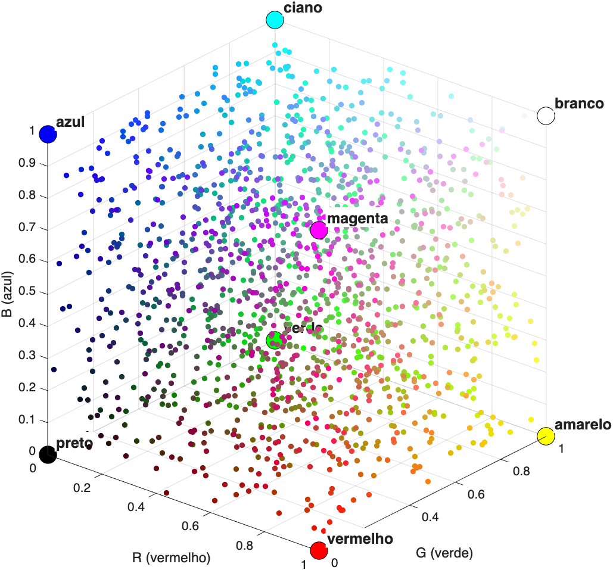

# IEM — Módulo de Visão Artificial
# Aula Prática 2 — IEM Paint

**Departamento de Engenharia Mecânica · Universidade de Aveiro**\
**Docente:** Miguel Riem de Oliveira · **Duração:** 3 horas

---

## O problema

Num programa de desenho convencional, o utilizador desloca o rato e o programa
recebe uma sequência de **coordenadas** `(x, y)` com as quais traça a linha.

Nesta aula será desenvolvido um programa de desenho no qual o rato é dispensado.
As coordenadas serão obtidas a partir da posição de um **objeto vermelho**
colocado à frente da câmara.

```
                   ┌──────────────────────────────────┐
  câmara ─────────►│   onde está a mancha vermelha?   │───► (x,y) ───► traço
                   └──────────────────────────────────┘
                          visão por computador
```

Todo o trabalho desta aula se destina a preencher a caixa intermédia.

## Uma imagem é uma matriz

Recapitulando a aula teórico-prática: a imagem proveniente da câmara tem `L`
linhas por `C` colunas, com uma terceira dimensão de valor 3. Trata-se de **três matrizes
sobrepostas**: uma indica, para cada pixel, a quantidade de vermelho; outra a
de verde; outra a de azul.

## O cubo das cores *(recapitulação)*

Representando os três valores — R, G e B — como três eixos, cada cor possível
corresponde a um ponto no interior de um cubo de lado unitário. A analogia é a
de um pintor com três guaches na paleta:

| Guaches utilizados | R, G, B | Resultado |
|---|---|---|
| apenas vermelho | 1, 0, 0 | vermelho puro |
| apenas azul | 0, 0, 1 | azul puro |
| nenhum | 0, 0, 0 | preto |
| todos no máximo | 1, 1, 1 | branco |
| vermelho e verde | 1, 1, 0 | amarelo |



**Sucede, porém, que no mundo real não existem cores puras.** O objeto vermelho
utilizado não terá `R = 1, G = 0, B = 0`, mas antes valores da ordem de
`0.87, 0.12, 0.19` — e esses valores variam com a iluminação da sala, com a
sombra da mão e com a posição do objeto.

Por esse motivo, não se procura *um ponto* no interior do cubo, mas sim uma
**região**: um intervalo de valores admissíveis para cada canal. Para cada
pixel, verifica-se se este pertence a essa região.

```
   R entre 0.8 e 1.0   e   G entre 0.0 e 0.3   e   B entre 0.0 e 0.3
```

São seis parâmetros, que terão de ser ajustados manualmente ao objeto
utilizado e à iluminação da sala. É por essa razão que ficam numa secção de
parâmetros no topo do programa, e não dispersos pelo código.

## Arquitetura do programa

```
cabeçalho e limpeza
secção de parâmetros
ligar a câmara

while 1
    1. adquirir a imagem
    2. preparar (reduzir, converter para 0-1)
    3. detetar a cor        →  máscara de valores verdadeiro/falso
    4. localizar o centro   →  coordenadas (cx, cy)
    5. pintar na tela
    6. apresentar os resultados
end
```

---

## Método de trabalho

Ao contrário da primeira aula prática, o trabalho desta aula consiste num
**único programa**, designado `iem_paint.m`, que vai sendo ampliado. Cada exercício
acrescenta um elemento.

**Após cada exercício, o programa tem de continuar a ser executado
corretamente.** Caso deixe de funcionar, resolva o problema antes de
prosseguir: é consideravelmente mais simples localizar um erro nas últimas três
linhas escritas do que num programa com uma centena.

Mantém-se a regra das aulas anteriores: **os enunciados indicam o nome da
função, não a forma de a utilizar**. Essa parte é consultada na documentação,
com o comando `doc` ou no Google.

Para interromper um ciclo infinito: **Ctrl+C** na *Command Window*.

---

# Secção 1 — Aquisição de vídeo

*Os passos desta secção e da seguinte foram demonstrados na aula teórico-prática,
pelo que deverão ser resolvidos com rapidez. Escreva-os, ainda assim, por si
próprio.*

**1.** Crie o ficheiro `iem_paint.m`, com um cabeçalho em comentário — nome e
número mecanográfico dos dois membros do grupo, e data — seguido das três
instruções de limpeza habituais. O URL do vídeo será acrescentado a este
cabeçalho no fim.

**2.** Liste as câmaras disponíveis (`webcamlist`) e crie o objeto
correspondente (`webcam`). Caso o
computador possua duas câmaras, experimente ambos os índices até obter a imagem
correta: uma delas poderá ser de infravermelhos, produzindo uma imagem
acinzentada.

**3.** Adquira uma imagem (`snapshot`) e apresente-a (`imshow`). Confirme o correto funcionamento
**antes** de prosseguir.

**4.** Coloque a aquisição e a visualização num ciclo infinito (`while`), com
uma breve pausa (`pause`) no seu interior. Deverá obter vídeo.

**5.** A imagem proveniente da câmara é demasiado grande e torna o ciclo lento.
Reduza-a para metade (`imresize`) imediatamente após a aquisição e converta-a
para valores entre 0 e 1 (`im2double`), uma vez que os limiares definidos em seguida pressupõem essa gama.

**6.** Divida a figura em três células dispostas em coluna (`subplot`) e
coloque a imagem na primeira. As restantes permanecem vazias nesta fase: a segunda destina-se à
deteção de cor e a terceira à tela onde se pinta.

---

# Secção 2 — Deteção de cor

**7.** Crie no topo do ficheiro, antes do ciclo, a secção de parâmetros com os
seis limiares:
```matlab
%% Parâmetros
r_min = 0.8;   r_max = 1.0;
g_min = 0.0;   g_max = 0.3;
b_min = 0.0;   b_max = 0.3;
```

**8.** No interior do ciclo, separe os três canais da imagem em três variáveis.

**9.** Construa a **máscara**: uma matriz de valores verdadeiro/falso, verdadeira
apenas nos pixels cujos três valores se situam simultaneamente dentro dos
intervalos definidos. Deve tratar-se de **uma única expressão**, sem qualquer
ciclo, tal como praticado na secção 4 da primeira aula prática.

**10.** Apresente a máscara na segunda célula. Deverá obter uma imagem a preto
e branco.

**11.** Apresente o objeto vermelho à câmara e verifique se surge uma mancha
branca.

Caso não surja nada, ou caso a imagem apareça quase integralmente branca, **os
seis parâmetros não são adequados à iluminação e ao objeto utilizados**.
Ajuste-os até que a mancha branca corresponda ao objeto e a mais nada. Este
ajuste não constitui um contratempo, mas parte integrante do exercício: nenhum
sistema de visão funciona com os parâmetros que constam do enunciado.

**12.** Afaste e aproxime o objeto, cubra-o parcialmente com a mão e coloque-o
em contraluz. Avalie a robustez da deteção, identifique os limiares que teve de
alargar e indique que elementos indevidos passaram a ser detetados quando o
alargamento foi excessivo.

---

# Secção 3 — Localização do objeto

**13.** Obtenha as coordenadas de linha e de coluna de todos os pixels
verdadeiros da máscara com a função `find`, utilizada com dois valores de
saída, como no exercício 29 da primeira aula prática.

**14.** Calcule o centro de massa com `mean`: a média das linhas e a média das
colunas. Guarde os resultados em `cy` e `cx`.

**15.** Apresente essas coordenadas no título da imagem superior (`title`),
com duas casas decimais (`sprintf`).

**16.** Assinale com uma cruz (`plot`), sobre a imagem original, a posição
determinada. Escolha uma cor que contraste com o vermelho, uma vez que uma cruz
vermelha sobre um objeto vermelho não seria visível. Não omita o `hold on`, que
impede o MATLAB de apagar a imagem antes de desenhar sobre ela.

> Primeiro a **coluna**, depois a **linha**. Se a cruz se deslocar em sentido
> contrário ao esperado, a causa é a troca destes dois valores.

**17.** Desloque o objeto para a direita e determine se `cx` aumenta ou diminui;
repita para o movimento vertical e para `cy`. Em seguida, **retire o objeto do
campo de visão da câmara** e observe o título. Justifique o resultado obtido,
recorrendo ao exercício 31 da primeira aula prática.

---

# Secção 4 — A tela

**18.** Crie, antes do ciclo, uma variável contador com o valor zero e
incremente-a no início de cada iteração.

**19.** **Apenas na primeira iteração**, crie a tela: uma imagem integralmente
branca (`ones`), com exatamente as mesmas dimensões da imagem da câmara
(`size`).

Antes de escrever o código, responda: **por que razão não pode a tela ser criada
antes do ciclo, juntamente com os parâmetros?**

**20.** Apresente a tela na terceira célula. Deverá visualizar uma faixa branca.

**21.** Acrescente aos parâmetros a cor do lápis:
```matlab
cor_lapis = [0 0 0];   % preto
```

**22.** Pinte na tela, na posição do centro de massa, atribuindo a cor do lápis
aos três canais desse pixel. As coordenadas resultam de uma média e os índices
de uma matriz têm de ser inteiros; resolva essa incompatibilidade com `round`.

**23.** O programa gerará um erro assim que o objeto for retirado do campo de
visão, pelo motivo identificado no exercício 17. Proteja a operação de pintura
com uma condição (`isnan`) que apenas pinte quando as coordenadas forem valores
válidos.

Experimente o programa. **A aplicação já pinta**, ainda que sob a forma de
pontos isolados e espaçados.

---

# Secção 5 — Espessura do lápis

**24.** Acrescente aos parâmetros a variável `espessura = 5;`.

**25.** Em vez de pintar um único pixel, pinte uma **região quadrada** em torno
do centro: as linhas desde `cy - espessura` até `cy + espessura`, procedendo de
forma análoga para as colunas. Corresponde ao exercício 13 da primeira aula
prática, aplicado agora a uma imagem real.

**26.** Desloque o objeto até um canto da imagem. O programa gera um erro;
identifique a causa.

**27.** Corrija o problema, garantindo que os índices nunca ultrapassam os
limites da imagem: nunca inferiores a 1, nunca superiores ao número de linhas ou
de colunas. As funções `max` e `min` resolvem cada uma destas condições numa
única instrução.

Experimente vários valores de espessura e produza um desenho.

---

> **Concluída esta secção, o IEM Paint está funcional.** As secções seguintes
> constituem melhorias e são o que distingue uma entrega suficiente de uma
> entrega de qualidade.

---

# Secção 6 — Interação por teclado

Nesta fase, alterar a espessura ou a cor obriga a interromper o programa, editar
o ficheiro e reiniciar a execução. Passará a ser possível fazê-lo com o teclado,
com o programa em execução.

**28.** Investigue de que forma uma figura do MATLAB reage a uma tecla premida:
consulte a documentação da propriedade `KeyPressFcn` de uma figura.

**29.** Escreva uma função que seja invocada sempre que uma tecla é premida e
associe-a à figura. Nesta fase, a função deve limitar-se a apresentar no ecrã a
tecla premida, de modo a confirmar o correto funcionamento antes de prosseguir.

**30.** Coloca-se agora o seguinte problema: a tecla é conhecida **no interior**
da função, mas quem dela necessita é o ciclo principal, que lhe é exterior. A
solução mais simples — não a mais recomendável, mas adequada a este caso — é
uma variável **global**, declarada tanto no script como no interior da função.
Implemente-a e confirme que consegue aceder à tecla a partir do ciclo.

**31.** Faça com que uma tecla aumente a espessura do lápis e outra a diminua.
Note que a espessura não pode assumir valores inferiores a 1.

**32.** Faça com que três teclas alterem a cor do lápis e que uma quarta limpe
integralmente a tela, repondo-a a branco.

---

# Secção 7 — Pintura sobre o vídeo

**33.** Em vez de apresentar a tela isoladamente, combine-a com a imagem da
câmara, atribuindo a cada uma metade do peso:
```matlab
imshow(0.5*tela + 0.5*I);
```
Deverá observar-se a imagem da câmara por detrás do desenho. É o mesmo efeito
que a transparência de uma camada num programa de edição de imagem.

**34.** Substitua o valor `0.5` por um parâmetro designado `transparencia` e
determine qual o valor que produz o melhor resultado.

---

# Secção 8 — Traço contínuo *(desafio)*

O programa pinta **pontos isolados**, um por cada iteração do ciclo. Se o objeto
for deslocado rapidamente, o traço apresenta-se descontínuo.

**35.** Guarde, no final de cada iteração, as coordenadas atuais numa variável
auxiliar, de modo a dispô-las na iteração seguinte.

**36.** Pinte uma **linha** entre a coordenada anterior e a coordenada atual, em
vez de um ponto isolado. Existem várias abordagens possíveis; o problema
consiste em gerar os pixels intermédios entre dois pontos. Pondere a solução
antes de escrever código.

**37.** Trate o caso em que não existe coordenada anterior — primeira iteração,
ou objeto fora do campo de visão. Nessa situação não deve ser traçada qualquer
linha, sob pena de surgir um traço a atravessar o desenho.

---

# Possíveis melhorias

- **Segunda cor.** Detetar igualmente um objeto azul, com o seu próprio conjunto
  de seis limiares, e pintar com um lápis distinto.
- **Espessura em função da distância.** O traço torna-se mais espesso quando o
  objeto se aproxima da câmara. A informação necessária já se encontra na
  máscara: quantos pixels tem a verdadeiro?
- **Borracha.** Uma tecla que passa a pintar a branco.
- **Gravação do desenho** num ficheiro de imagem (`imwrite`).
- **Redução de ruído.** Eliminar as manchas de pequena dimensão da máscara antes
  de calcular o centro (`bwareaopen`), de modo a estabilizar a posição detetada.
- **Melhor desenho da turma.** Também é considerado.

---

## Funções e comandos utilizados, por secção

| Secção | Funções e comandos |
|---|---|
| 1 | `webcamlist`, `webcam`, `snapshot`, `imshow`, `while`, `pause`, `imresize`, `im2double`, `subplot` |
| 2 | `I(:,:,1)`, operadores `>=`, `<=`, `&` |
| 3 | `find`, `mean`, `sprintf`, `title`, `hold on`, `plot` |
| 4 | `size`, `ones`, `if`, `round`, `isnan`, `~`, `&&` |
| 5 | intervalos de índices, `max`, `min`, `size` |
| 6 | `KeyPressFcn`, `global`, `function` |
| 8 | `linspace`, `round` |
| Melhorias | `imwrite`, `sum`, `bwareaopen` |
